# The `pmt` optimizer

`pmt compile` lowers `.pmc` source to a per-function control-flow graph
of basic blocks (`docs/pmt/language.md (the IR artifact)`), and the
optimizer sits between that lowering and code generation. It rewrites
the CFG and only the CFG: it never reads or edits assembly text, and
every instruction the assembler eventually sees is produced by codegen
from the graph the optimizer handed back.

There are two levels. `-O0`, the default, runs no pass at all. `-O1`
runs the whole pipeline: one program-level pass, `inline`, at the start
of every round, then ten per-function passes in a fixed order —
`check-fold`, `jump-threading`, `cell-state`, `branch-fold`,
`tail-sink`, `tail-call`, `tail-merge`, `dce`, `move-elim`,
`fuse-tape-ops`. Those eleven names, hyphenated exactly as written, are
what `--fno-<pass>` and
`--emit-ir=after:<pass>` accept. The `--release` preset is
`-O1 --strip-debugger` and `--debug` is `-g -O0`, so `--release` implies
an optimized build and `--debug` an unoptimized one
(`docs/pmt/cli.md (compile)`).

The pipeline runs to a **fixpoint**: one round applies every enabled
pass once, and rounds repeat as long as some pass changed something, to
a cap of ten rounds. Passes are therefore each other's inputs — a fold
that turns a `check` into a `goto` hands the next round's `dce` an
unreachable block — and this cascading is the normal case, not the
exception. `-v` renders the round report:

```
$ pmt compile -O1 -v -o cells.pmo cell-state.pmc
opt: 2 round(s)
  cell-state main: 2 change(s)
  fuse-tape-ops main: 1 change(s)
```

One line per pass per function that changed something, in the order the
changes happened; the program-level `inline` reports its function as
`(module)`. The round count includes the last round, the one in which
nothing changed and the fixpoint was reached — so a two-round report
describes one round of work. At `-O0` the report is `opt: 0 round(s)`
and nothing follows it.

## Contracts

Five properties bind the pipeline. They are contracts, not preferences —
where a pass cannot honour one, the pass does not fire.

**`-O0` is an off switch, not a setting.** At `-O0` the optimizer
returns before a single pass runs, so `-O0` output is exactly what
codegen makes of the lowered CFG: no optimizer artifact can leak into an
unoptimized build, and no pass has an "even at `-O0`" clause. The two IR
snapshots bracketing the pipeline are byte-identical there, and so are
the objects built from them:

```
$ pmt compile -O0 --emit-ir=lowered -o lowered.pmo cell-state.pmc
$ pmt compile -O0 --emit-ir=final -o final.pmo cell-state.pmc
$ cmp lowered.ir.json final.ir.json && cmp lowered.pmo final.pmo && echo identical
identical
```

Fall-through block layout is not a counterexample to this: it belongs
to codegen and is active at every level
(`docs/pmt/language.md (optimization)`).

**Observable equivalence.** Every pass preserves the final tape
contents, the termination kind (`stp`, `hlt`, or which trap), and every
branch decision that depends on the match flag. An `-O1` build computes
what the `-O0` build computes.

Two things are deliberately outside that guarantee. Step counts and
intermediate states may differ — that is the point of the exercise. And
resource-limit outcomes may differ, because passes change how much of
the machine's finite resources a program consumes: `tail-call` turns a
self-recursive call into an in-place jump, so a program that exhausts
the return stack at `-O0` runs forever — and hits the step budget — at
`-O1`. The termination kind changes there because a *resource* ran out
differently, not because the program came to mean something else:

```c
spin() {
    right;
    @spin(!);
}

main() {
    @spin();
}
```

```
$ pmt compile -O0 -o spin.pmo spin.pmc && pmt link spin.pmo -o spin-O0.pmx
$ pmt compile -O1 -o spin.pmo spin.pmc && pmt link spin.pmo -o spin-O1.pmx
$ pmt run spin-O0.pmx --tape-cells "*" --max-steps 100000
outcome: Trapped(StackOverflow)
…
$ pmt run spin-O1.pmx --tape-cells "*" --max-steps 100000
outcome: Trapped(StepLimit)
…
```

The guarantee is stated for PM-1's default, idempotent write semantics.
`pmt run --strict-cells` replaces them, making it a fault to mark an
already-marked cell or unmark an already-blank one
(`docs/pmt/isa.md (the tape)`) — and removing exactly such writes is
`cell-state`'s job, so under that flag an `-O1` build can stop where the
`-O0` build faults:

```c
main() {
    mark;
    mark;
}
```

```
$ pmt compile -O0 -o strict.pmo strict.pmc && pmt link strict.pmo -o strict-O0.pmx
$ pmt compile -O1 -o strict.pmo strict.pmc && pmt link strict.pmo -o strict-O1.pmx
$ pmt run strict-O0.pmx --tape-cells " " --strict-cells
outcome: Trapped(Device { fault: StrictCellViolation })
…
$ pmt run strict-O1.pmx --tape-cells " " --strict-cells
outcome: Stopped
…
```

Building with `--fno-cell-state` restores the fault, which is what a
program whose behaviour depends on strict-cell violations should do.

**The `brk` barrier.** An un-stripped `debugger` statement (`brk` in the
ISA) is an observability barrier: no pass moves code across it, and none
eliminates anything on the strength of a fact carried across it, so a
debugger attached to an `-O1` build sees honest machine state at every
breakpoint. `mark; debugger; mark;` keeps both writes at `-O1`, where
without the barrier between them `cell-state` would drop the second:

```
$ pmt compile -O1 -v -S -o barrier.pma barrier.pmc
opt: 1 round(s)
$ cat barrier.pma
.func main
        wr      1
        brk
        wr      1
        stp
```

The barrier is a property of the IR, and `--strip-debugger` drops `brk`
at codegen — after the optimizer has already run. A stripped build
therefore still pays for the breakpoint it does not contain: both writes
survive, with nothing left between them.

```
$ pmt compile -O1 --strip-debugger -S -o stripped.pma barrier.pmc
$ cat stripped.pma
.func main
        wr      1
        wr      1
        stp
```

That is what makes a stray `debugger` worth reporting as source hygiene
(`docs/pmt/lint.md (leftover-debugger, .pmc side)`) rather than harmless.

**`tail-call` runs before `tail-merge`.** The order of the two is
load-bearing, not a preference. `tail-merge`'s return-chaining rewrites
a `Return` into a fall-through, which would destroy `tail-call`'s
precondition — a trailing call in a block that returns — before
`tail-call` ever saw it. Statically the two are a tie, each removing one
terminal instruction; `tail-call`'s decisive win is at run time, where
it costs neither a stack slot nor a return trip.

**The MF-coupling invariant.** Every PM-1 tape instruction — `lft`,
`rgt`, `wr`, `wrl`, `wrr` — latches MF from the cell at the resulting
head position, and nothing else changes MF or moves the head
(`docs/pmt/isa.md (registers)`). So once at least one tape instruction
has executed in the current function, MF *is* "the cell under the head
is marked", and that equality is the entire basis on which `cell-state`
drops a write and `branch-fold` decides a `check`. A `call` keeps the
coupling but forgets the value, since the callee may write anywhere; a
`brk` keeps the coupling too and forgets the value for the barrier
reason above.

Before any tape instruction has executed in the current function, the
analysis assumes nothing. No cell value is proven at a function's entry,
and the arms of a `check` reachable from there refine nothing either, so
such a `check` is never folded and the writes in its arms are never
dropped. Here the whole `-O1` pipeline leaves the program alone:

```
$ pmt compile -O1 -v -S -o coupling.pma coupling.pmc
opt: 1 round(s)
$ cat coupling.pma
.func main
        jnm     L2
        wr      1
        stp
L2:
        wr      0
        stp
```

One `right` in front of the same `check` couples MF to the tape, and the
program collapses: on the marked arm the cell is provably `1`, so
`mark` is a no-op, on the blank arm `unmark` is, the two arms become the
same block, and the `check` that chose between them decides nothing.

```
$ pmt compile -O1 -v -S -o coupled.pma coupled.pmc
opt: 3 round(s)
  cell-state main: 2 change(s)
  tail-merge main: 1 change(s)
  check-fold main: 1 change(s)
$ cat coupled.pma
.func main
        rgt
        stp
```

## Volatile builds

A **volatile program** — one whose entry is declared `volatile main()`
(`docs/pmt/language.md (volatile programs)`) — drives a device rather
than memory. Every tape access is externally observable, and the outside
world may change the cell under the head between two accesses. That
generalizes the `brk` barrier above from a point to a standing,
whole-run rule: no pass may assume a value written to the tape reads
back, and no pass may change the tape's access sequence — no dropping
idempotent or dead writes, no fusing write+move shapes, no deciding a
branch from a value the program only wrote.

The compiler does not switch the pipeline on a flag. It builds every
function twice — the ordinary column, and a **gated** column that runs
this same pipeline with three passes disabled — and the linker picks one
column per name from the program's volatile bit
(`docs/core.md (linking)`). So the gated build is still an optimized
build; it is simply not optimized on any assumption about what the tape
will answer.

**The gated set** is `cell-state`, `branch-fold`, `fuse-tape-ops`, and
`move-elim`. The dividing line is what a pass believes about the tape:

- `cell-state` drops idempotent and dead writes. Both rules delete a
  write the source asked for, and the idempotent rule additionally reads
  its licence off a preceding write.
- `branch-fold` decides a `check` from a known cell value. Where that
  knowledge came from a `check` edge it is the latched flag and stays
  sound; where it came from a `wr` it is exactly the write-read-back
  assumption. The gate is per PASS, not per path, so the sound half is
  gated with the unsound one.
- `fuse-tape-ops` folds `wr x` plus a move into `wrl`/`wrr`, which skips
  the intermediate latch read of the written cell: two device
  transactions become one.
- `move-elim` deletes an inverse move pair (`rgt; lft` or `lft; rgt`).
  Each half of the pair is a device access on a volatile band regardless
  of which soundness proof licensed the deletion, so dropping the pair
  drops two accesses the outside world could have observed between them.

The remaining seven keep running. Six of them only rewire control flow,
or relocate already-identical code, between accesses they leave
untouched (`check-fold`, `jump-threading`, `tail-sink`, `tail-call`,
`tail-merge`, `inline`) and `dce` deletes code that never runs. Note
`check-fold` is NOT the same shape as `branch-fold` despite the
neighbouring names: it rewrites `Check{k, k}` into `Goto{k}`, a test
whose two arms already name one block, and consults nothing about the
tape at all.

**The MF-coupling invariant is moot in the gated column.** That
invariant (under Contracts above) is the entire licence for reasoning
about a cell's value from a preceding write, and it lives in one
dataflow module whose only two consumers are `cell-state` and
`branch-fold`. Both are gated, so in a volatile build the analysis has
no live consumer at all — the question of whether a written value can be
predicted never arises rather than being answered carefully. The match
flag as a REGISTER — latched by an access the program actually
performed, then read again with no access in between — is untouched by
any of this and stays sound on any tape.

### A worked example

Eleven tape commands, in two comma groups:

```c
main() {
    mark, mark, right, unmark, mark;
    left, mark, unmark, mark, right, unmark;
}
```

Compiled at `-O1`, that is four instructions:

```
$ pmt build -O1 pulse.pmc -o pulse.pmx && pmt dis pulse.pmx
.func main
        wrr     1
        wrl     1
        wrr     1
        wr      0
        stp
```

Two passes did all of it. `cell-state` dropped four of the eight writes —
one idempotent re-`mark`, and three whose value was overwritten before
anything could read it — and `fuse-tape-ops` folded the three surviving
writes that are followed by a move into `wrl`/`wrr`:

```
$ pmt compile -O1 -v pulse.pmc -o pulse.pmo
opt: 2 round(s)
  cell-state main: 4 change(s)
  fuse-tape-ops main: 3 change(s)
```

The same body with `volatile main` keeps all eight writes and all three
moves, as eleven separate bus transactions:

```
$ pmt build -O1 pulse-v.pmc -o pulse-v.pmx && pmt dis pulse-v.pmx
.func main
        wr      1
        wr      1
        rgt
        wr      0
        wr      1
        lft
        wr      1
        wr      0
        wr      1
        rgt
        wr      0
        stp
```

Both programs leave the same tape and stop the same way — the observable
equivalence contract holds across the two columns as it does across
`-O0` and `-O1` — and the cost of the difference is what the timing
model charges for those extra transactions
(`docs/core.md (timing model)`):

```
$ pmt run pulse.pmx --tape-cells " "
outcome: Stopped
steps 5, core tacts 15, stall tacts 11 (total 26)
origin 0, head 1 reads ' '
|* |
$ pmt run pulse-v.pmx --tape-cells " "
outcome: Stopped
steps 12, core tacts 33, stall tacts 22 (total 55)
origin 0, head 1 reads ' '
|* |
```

For memory the four-instruction form is pure win. For a device those
"redundant" transactions — keep-alive pulses, command sequences,
intermediate sensor samples — are what the program is *for*, and
dropping them is not an optimization but a different program.

The strict-cells example under Contracts above is the same story from
the other end: what `--fno-cell-state` buys one pass at a time,
`volatile main` states once for the whole program
(`docs/pmt/isa.md (the tape)`).

**Seeing the gated column.** `pmt compile -S` and `--emit-ir` render the
NORMAL column, for a volatile program too — they describe one
compilation, not one link. `pmt ir graph FILE.pmc --variant volatile`
renders the gated CFG, and `pmt dis` of the linked `.pmx` shows what
actually shipped (`docs/pmt/cli.md (pmt ir)`).

**One caveat about `-O0`.** `-O0` is an off switch for the unit the
compiler is compiling, so its two columns are identical and the program
bit changes nothing about that unit's own code. It does not follow that
a `-O0` *image* is bit-independent: the embedded standard library is
compiled at `-O1` regardless of the flag on the command line
(`docs/pmt/stdlib.md`), and three of its routines really do ship two
columns, so a `-O0` link of a volatile program that reaches one of them
takes the gated body and produces a different image than the same
program without the modifier.

## Reading the examples

Each pass below is shown transforming a small program, and every example
follows the same recipe: compile once with `--emit-ir=lowered` for the
CFG as lowering produced it, once with `--emit-ir=after:<pass>` for the
CFG right after that pass last changed something, and render both with
`pmt ir graph` (`docs/pmt/cli.md (ir)`). `-v` on the first compile shows
which passes fired and how often, which is how one can tell that a
fragment shows what it claims to show.

Every mermaid-fenced block on this page is the verbatim output of the
`pmt ir graph` command shown immediately above it, fenced as mermaid so
it renders as the diagram it describes rather than as text.

An `after:<pass>` snapshot exists only if the pass actually changed
something. Asking for one that never fired is an error, not a silent
fall-back to the final CFG:

```
$ pmt compile -O1 --emit-ir=after:dce -o inlined.pmo inline.pmc
pmt: no IR snapshot labeled `after:dce` was captured
```

In the rendered graphs one node is one basic block: `Bn` is its id, a
leading `N:` line is a source label the block carries, and the remaining
lines are its ops (`lft`, `rgt`, `wr i`, `wrl i`, `wrr i`, `brk`,
`call @f`) followed by its terminator where the terminator has a
rendering of its own (`ret`, `hlt`, `jmp @f`). Edges are labelled `goto`
for an unconditional jump and `MF`/`!MF` for the two arms of a `check`;
an unlabelled edge is a fall-through. A block with nothing in it renders
as `(empty)`.

These snapshots are mid-pipeline, so a graph may well show a shape a
later pass cleans up. Where that happens the example says so.

## The passes

### inline

Splices a small callee into its call site. This is the one pass that
works across functions, and it runs at the start of every round, ahead
of the per-function pipeline. A function is a candidate when it is not
`main`, contains no call and no `brk`, and is either at most six ops
long or has exactly one call site in the whole module. The candidate set
is computed once from the state at the start of the pass, so a function
that becomes a leaf during this pass is not spliced until the next
round.

Each restriction has a reason. `main`'s `Return` is the machine
stopping, and splicing it would turn "stop" into "keep going". A callee
containing `brk` is refused because inlining erases the call frame a
debugger would show. A callee that calls anything itself is not spliced,
which also settles recursion: a function that calls itself is not a
leaf, so neither its recursive call nor any other call to it is ever
spliced. What the pass buys is less the saved `call`/`ret` pair than the
dissolved barrier — the value analysis behind `cell-state` and
`branch-fold` forgets what it knows across a `call`, and after inlining
there is no call left to forget across.

```c
step() {
    right;
}

main() {
    @step();
    mark;
}
```

```
$ pmt compile -O1 -v --emit-ir=lowered -o lowered.pmo inline.pmc
opt: 2 round(s)
  inline (module): 1 change(s)
$ pmt ir graph lowered.ir.json --function main
```

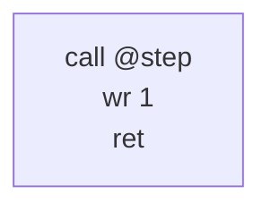

```
$ pmt compile -O1 --emit-ir=after:inline -o inlined.pmo inline.pmc
$ pmt ir graph inlined.ir.json --function main
```

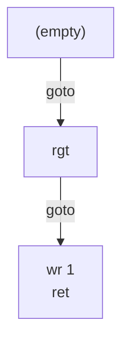

The call site's block is split in two: `B0` keeps whatever preceded the
call, the callee's blocks are cloned in after it (`B2`, with the
callee's labels dropped — they mean nothing here), and everything that
followed the call moves to a continuation block (`B1`) that the callee's
`Return` now jumps to. Codegen lays those out to fall through, and the
linker, finding no call site left, leaves `step` out of the image
altogether (`docs/core.md (linking)`):

```
$ pmt compile -O1 -o inline.pmo inline.pmc && pmt link inline.pmo -o inline.pmx
$ pmt dis inline.pmx
.func main
        rgt
        wr      1
        stp
```

Because inlining binds a call at compile time, a library meant to stay
fully interposable should be built with `--fno-inline`
(`docs/pmt/language.md (optimization)`).

**The inline-cap sweep.** `INLINE_MAX_OPS`, the six-op ceiling above, was
re-measured against a corpus of golden programs (each on its committed
inputs), a non-terminating program run to a fixed step budget, and the
embedded standard library's own source, compiled and run at caps 6, 12,
and 24:

```
cap       total steps    total bytes   total instrs
6                1231            259            191
12               1231            259            191
24               1231            259            191
```

Every column is flat across the swept range: no corpus member's compiled
code differs at all between cap 6 and cap 24, so there is no step win to
buy at a wider cap and the constant stays at `INLINE_MAX_OPS = 6`. The
flatness is a fact about the corpus, not a blind spot in the pass: every
routine the standard library exports is 2–4 ops, already well under the
cap-6 threshold, and every golden program either declares no local
callees at all or declares one with exactly one call site, which this
pass's single-call-site exception admits irrespective of any cap. Nothing
in the corpus falls in the 7–24-op range a wider cap would have to reach.

One caveat on the "total bytes" column for anyone re-running or
extending this sweep: it mixes two bases. A golden program's own entry
measures the linked, relaxed executable's code size, while a
library-only entry with no `main` to link against — the standard library
source, compiled but never linked — measures the unlinked object's own
byte count before relaxation. Cap-over-cap deltas within one entry are
still valid (each entry's own basis stays constant across every cap
compared), but the column is not uniformly "linked image bytes" end to
end.

### check-fold

A `check` whose two arms are the same block decides nothing, so it
becomes an unconditional `goto`. That is the entire pass; the one-armed
`jm`/`jnm` shapes are codegen's adjacency choice, not a rewrite here.

Identical arms are rarely written by hand. They appear after
`tail-merge` collapses two identical blocks into one, or after a
refactor leaves a distinction that no longer distinguishes — which is
exactly why the pass earns its place in a fixpoint pipeline rather than
in a one-shot cleanup.

```c
main() {
    right;
    check(5, 5);
 5: mark;
}
```

```
$ pmt compile -O1 -v --emit-ir=lowered -o lowered.pmo check-fold.pmc
opt: 2 round(s)
  check-fold main: 1 change(s)
$ pmt ir graph lowered.ir.json --function main
```

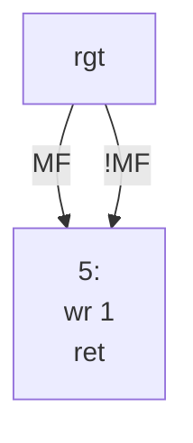

```
$ pmt compile -O1 --emit-ir=after:check-fold -o folded.pmo check-fold.pmc
$ pmt ir graph folded.ir.json --function main
```

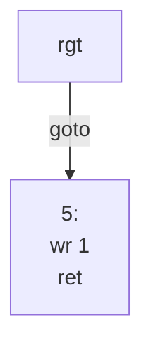

### jump-threading

An edge that lands on an empty block whose only act is to jump onward is
retargeted to the final destination; a chain of such forwarders collapses
in one application of the pass. A *cycle* of empty forwarders is left
exactly as written — it is a deliberate infinite loop, and threading it
would be a rewrite of intent:

```c
main() {
 1: goto 1;
}
```

```
$ pmt compile -O1 -v -S -o selfloop.pma selfloop.pmc
opt: 1 round(s)
$ cat selfloop.pma
.func main
L1:
        jmp     L1
```

The pass moves edges only. The forwarder blocks it orphans are `dce`'s
to delete, which happens later in the same round.

```c
main() {
    right;
    check(1, 2);
 1: goto 3;
 2: goto 4;
 3: left(!);
 4: right;
}
```

```
$ pmt compile -O1 -v --emit-ir=lowered -o lowered.pmo jump-threading.pmc
opt: 2 round(s)
  jump-threading main: 2 change(s)
  dce main: 2 change(s)
$ pmt ir graph lowered.ir.json --function main
```

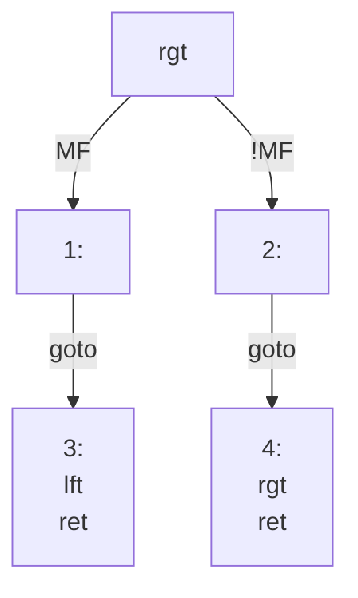

```
$ pmt compile -O1 --emit-ir=after:jump-threading -o threaded.pmo jump-threading.pmc
$ pmt ir graph threaded.ir.json --function main
```

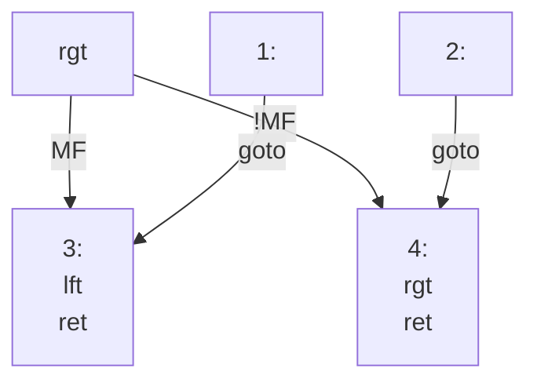

The check now branches to the real destinations, and `B1`/`B2` are
still there, unreferenced — the snapshot is taken between the two
passes. By the end of the round `dce` has removed them:

```
$ pmt compile -O1 --emit-ir=final -o final.pmo jump-threading.pmc
$ pmt ir graph final.ir.json --function main
```

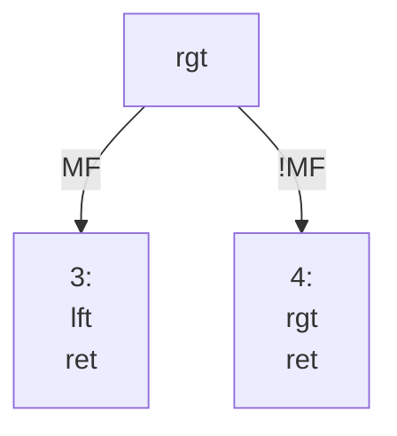

Whether that saves bytes depends on the layout codegen would have
chosen: a forwarder immediately in front of its target costs nothing
even at `-O0`. Here neither of the two was adjacent to its target, so
both were real instructions and both are gone:

```
$ pmt compile -O0 -S -o plain.pma jump-threading.pmc
$ pmt compile -O1 -S -o opt.pma jump-threading.pmc
$ diff plain.pma opt.pma
3,7c3
<         jnm     L2
<         jmp     L3
< L2:
<         jmp     L4
< L3:
---
>         jnm     L4
```

### cell-state

The historic redundant mark/unmark elimination, generalized to `wr`.
Two rules, both riding on the MF-coupling invariant above.

An **idempotent write** is a `wr i` on a path where the cell provably
already holds `i`. It changes neither the tape nor MF — the latch it
would perform and the MF already in place agree — so it goes. The proof
comes from the forward analysis: a `wr` establishes the value it wrote,
a move loses it (the destination cell is unknown), a `call` or a `brk`
loses it, and the arms of a `check` refine it on coupled paths, one arm
knowing the cell is marked and the other knowing it is blank.

A **dead store** is a `wr` overwritten by a later `wr` in the same
block, with nothing in between that could observe the first value. The
window is block-local and closes on anything that could make the value
visible: a move (the head leaves the cell, exposing what was written), a
`call` (the callee may read it), a `brk` (the barrier), or a fused
write+move, which ends the window exactly as a bare move does.

```c
main() {
    mark;
    mark;
    right;
    mark, unmark;
}
```

```
$ pmt compile -O1 -v --emit-ir=lowered -o lowered.pmo cell-state.pmc
opt: 2 round(s)
  cell-state main: 2 change(s)
  fuse-tape-ops main: 1 change(s)
$ pmt ir graph lowered.ir.json --function main
```

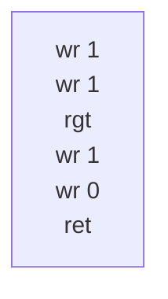

```
$ pmt compile -O1 --emit-ir=after:cell-state -o cells.pmo cell-state.pmc
$ pmt ir graph cells.ir.json --function main
```

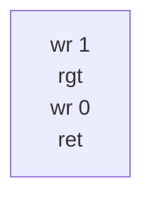

One change per rule: the second `mark` is idempotent after the first,
and the `mark` in `mark, unmark` is a dead store overwritten by the
`unmark`. The first `mark` survives — at the function's entry no cell
value is proven, so nothing licenses dropping it. (`fuse-tape-ops` then
fuses the surviving `wr 1` with the `rgt`; that pass is below.)

Both rules assume PM-1's default idempotent write semantics; under
`pmt run --strict-cells` a removed write is a removed fault, which is
the precondition the equivalence contract above carries.

### branch-fold

A `check` whose match flag is statically known goes unconditional. The
analysis is the one `cell-state` uses: where the cell under the head is
proven, MF is proven with it by the coupling invariant, so the `check`
can be replaced by a `goto` to the arm that would have been taken. Where
the cell is not proven — in particular before any tape instruction has
run in the function — nothing is folded.

The pass only redirects the terminator. The arm it did not take becomes
unreachable, and `dce` removes it later in the same round.

```c
main() {
    mark;
    check(1, 2);
 1: unmark(!);
 2: right;
}
```

```
$ pmt compile -O1 -v --emit-ir=lowered -o lowered.pmo branch-fold.pmc
opt: 2 round(s)
  branch-fold main: 1 change(s)
  dce main: 1 change(s)
$ pmt ir graph lowered.ir.json --function main
```

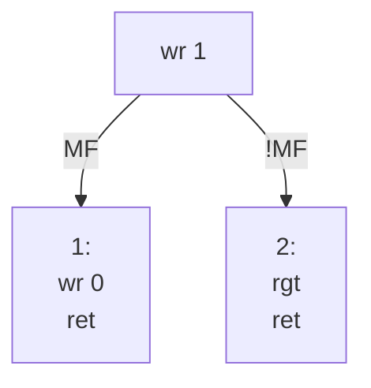

```
$ pmt compile -O1 --emit-ir=after:branch-fold -o branched.pmo branch-fold.pmc
$ pmt ir graph branched.ir.json --function main
```

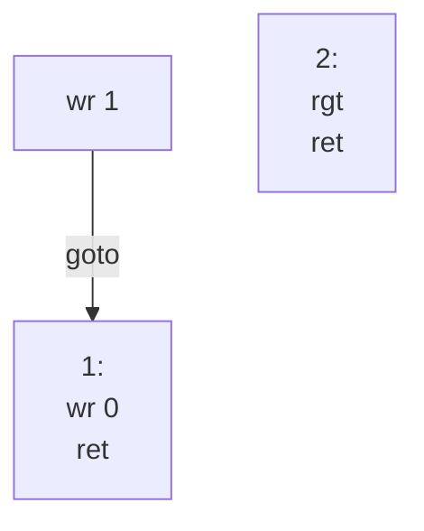

```
$ pmt compile -O1 --emit-ir=final -o final.pmo branch-fold.pmc
$ pmt ir graph final.ir.json --function main
```

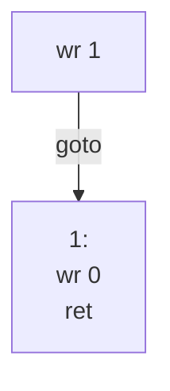

`mark` writes 1, so MF is 1 and the marked arm is the only one
reachable; `B2` survives one snapshot and is then dropped.

### tail-sink

**Tail sinking** is the suffix-level dual of `tail-merge`'s whole-block
dedup below: where `tail-merge` collapses two blocks that are identical
end to end, `tail-sink` handles the more common partial case, where two
`check` arms differ at the front — the code that made them worth
branching on — but converge on identical trailing ops. Only that shared
suffix moves, out of each arm and onto the front of the block the two
arms join into; nothing sinks past a point where the arms still
disagree, since that would mean choosing which arm's now-earlier ops to
keep.

A block `J` qualifies as the join when it has exactly two predecessors
that reach it by a `goto` or a fall-through edge, those two are distinct
from each other and from `J` itself, and no other edge reaches `J` — not
a `check` arm, and not `J` being the function's own entry, which is
modelled as one such "other" edge on the entry block so a function's
first block can never qualify. A third way to reach `J`, even a `check`
arm that never fires at runtime, means some execution could observe `J`
without having executed the sunk suffix, so it has to be ruled out
statically rather than left to chance.

```c
main() {
    check(1, 2);
 1: mark;
    right;
    right;
    goto 3;
 2: left;
    right;
    right;
 3: unmark;
}
```

```
$ pmt compile -O1 -v --emit-ir=lowered -o lowered.pmo tail-sink.pmc
opt: 2 round(s)
  tail-sink main: 2 change(s)
$ pmt ir graph lowered.ir.json --function main
```

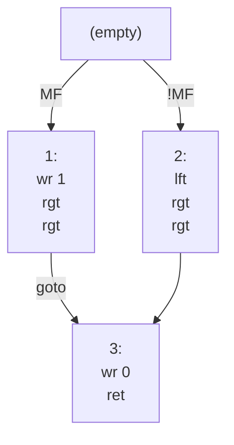

```
$ pmt compile -O1 --emit-ir=after:tail-sink -o sunk.pmo tail-sink.pmc
$ pmt ir graph sunk.ir.json --function main
```

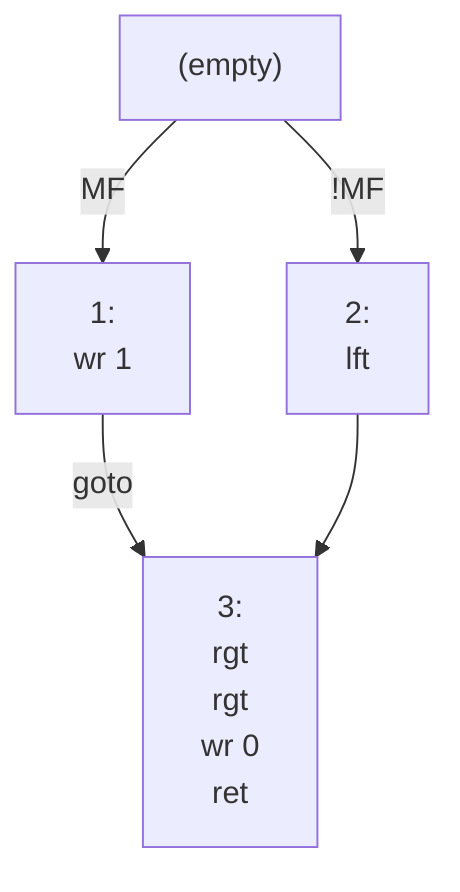

The two `rgt`s common to both arms are cut from `B1` and `B2` and
spliced onto the front of `B3`; a suffix has to be at least two ops long
to sink; a one-op match is left alone, since a single relocated op saves
nothing a fall-through wasn't already giving away for free.

**Fall-through layout is untouched.** This pass only moves ops between
existing blocks — it never adds, removes, reorders, or retargets a block
or a terminator — so the physical layout codegen chooses is exactly what
it would have been anyway, and which terminators codegen elides as
fall-through is decided the same way it always was. One consequence is
visible in the assembly: `B2`'s fall-through into `B3` still costs
nothing, but `B1` now has to jump over `B2` to reach the relocated
suffix, so of the two arms, at most one ever pays for the jump the sink
introduced.

```
$ pmt compile -O1 -S -o opt.pma tail-sink.pmc
$ cat opt.pma
.func main
        jnm     L2
        wr      1
        jmp     L3
L2:
        lft
L3:
        rgt
        rgt
        wr      0
        stp
```

A `debugger` stops the upward scan on whichever arm carries it: the
comparison walks from the end of both arms and halts, without counting
the pair at that position, as soon as either side's op is a `brk` — a
breakpoint never sinks, even when both arms carry an identical one, and
nothing before it may sink past it either, since a debugger attached
there must still see it fire from its own arm.

```c
main() {
    check(1, 2);
 1: debugger;
    right;
    right;
    goto 3;
 2: debugger;
    right;
    right;
 3: unmark;
}
```

```
$ pmt compile -O1 -v --emit-ir=after:tail-sink -o brk.pmo tail-sink-brk.pmc
opt: 2 round(s)
  tail-sink main: 2 change(s)
$ pmt ir graph brk.ir.json --function main
```

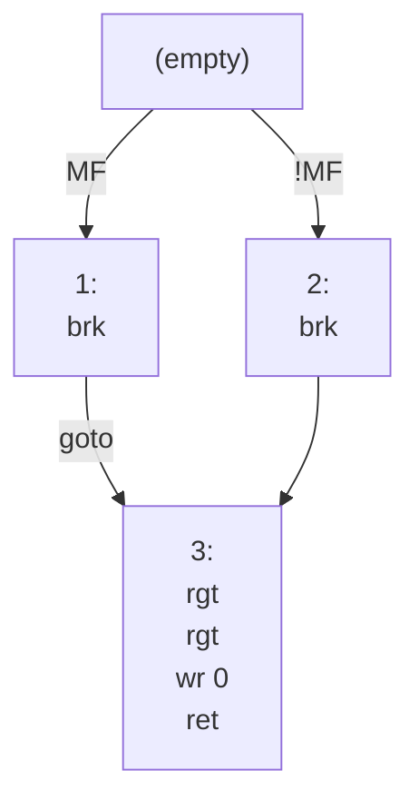

Only the two `rgt`s past each `brk` sink; the breakpoint itself stays
exactly where its own arm had it.

Because no access is ever added, dropped, merged, split, or reordered on
any executed path — only two static copies of the identical instruction
become one, and every path still performs the same sequence of accesses
in the same order it always did — `tail-sink` is **not** in the gated
set above: it runs the same in the volatile column as the ordinary one.
A `wr 1` writes 1 whether MF took the marked or the blank arm to reach
it, so replacing two static copies with one dynamic execution changes
nothing a device on the other end of the tape could observe.

### tail-call

A call in tail position — the last op of a block that returns — becomes
a jump to the callee instead of a `call` followed by a `ret`. It saves a
stack slot and the return trip, and it is what turns self-recursion into
an in-place loop.

The pass never applies inside `main`, whose return is the machine's
`stp`: the callee's `ret` would underflow the return stack. A call that
is not the last op of its block is not in tail position and is left
alone.

Small leaf callees are usually inlined before this pass can see them, so
the example disables `inline` — which is also what `--fno-<pass>` is for
when reading IR.

```c
main() {
    @outer();
}

outer() {
    right;
    @inner();
}

inner() {
 1: right;
    check(1, 2);
 2: left;
}
```

```
$ pmt compile -O1 -v --fno-inline --emit-ir=lowered -o lowered.pmo tail-call.pmc
opt: 2 round(s)
  tail-call outer: 1 change(s)
$ pmt ir graph lowered.ir.json --function outer
```

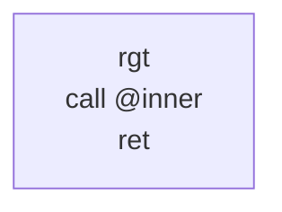

```
$ pmt compile -O1 --fno-inline --emit-ir=after:tail-call -o tailed.pmo tail-call.pmc
$ pmt ir graph tailed.ir.json --function outer
```


The call op and the `ret` have become one `jmp` — a terminator, not an
op. In the same program `main`'s call to `outer` is in tail position
too, and stays a call:

```
$ pmt ir graph tailed.ir.json --function main
```


### tail-merge

Two rewrites that both end up sharing one copy of a terminal shape.

**Whole-block dedup**: blocks with the same ops (line numbers aside) and
the same terminator collapse into one, the earliest copy being kept and
every reference to the others retargeted to it.

**Return-chaining**: a returning block physically followed by an *empty*
returning block falls through into it instead of returning itself, so
one terminal instruction serves both paths.

Merging of partial tails — a shared suffix of two otherwise different
blocks — is not implemented; only whole blocks dedup.

```c
main() {
 1: check(2, 3);
 2: mark, right(!);
 3: mark, right(!);
}
```

```
$ pmt compile -O1 -v --emit-ir=lowered -o lowered.pmo tail-merge.pmc
opt: 3 round(s)
  tail-merge main: 1 change(s)
  fuse-tape-ops main: 1 change(s)
  check-fold main: 1 change(s)
$ pmt ir graph lowered.ir.json --function main
```

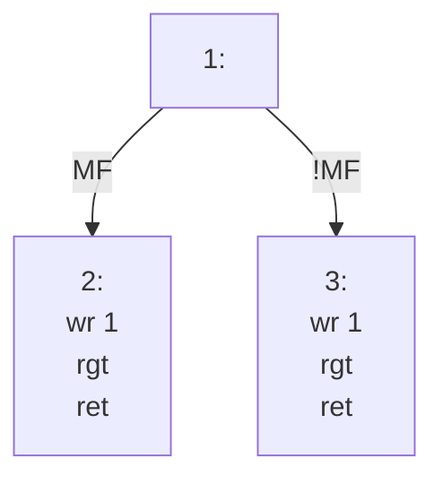

```
$ pmt compile -O1 --emit-ir=after:tail-merge -o merged.pmo tail-merge.pmc
$ pmt ir graph merged.ir.json --function main
```

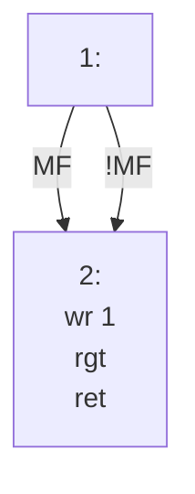

This is the cascade `check-fold` exists for: the two arms are now the
same block, so the `check` decides nothing and the next round folds it,
by which point `fuse-tape-ops` has also fused the write and the move.

```
$ pmt compile -O1 --emit-ir=final -o final.pmo tail-merge.pmc
$ pmt ir graph final.ir.json --function main
```

```mermaid
%% main
flowchart TD
    B0["1:"]
    B1["2:<br/>wrr 1<br/>ret"]
    B0 -->|goto| B1
```

Return-chaining is the other half. Here one arm of the `check` returns
immediately and the other writes first; the writing block is physically
followed by the empty returning one, so it falls into it rather than
carrying a return of its own:

```c
main() {
 1: check(!, 2);
 2: mark(!);
}
```

```
$ pmt compile -O1 -v --emit-ir=lowered -o lowered.pmo return-chain.pmc
opt: 2 round(s)
  tail-merge main: 1 change(s)
$ pmt ir graph lowered.ir.json --function main
```

```mermaid
%% main
flowchart TD
    B0["1:"]
    B1["2:<br/>wr 1<br/>ret"]
    B2["ret"]
    B0 -->|MF| B2
    B0 -->|!MF| B1
```

```
$ pmt compile -O1 --emit-ir=after:tail-merge -o chained.pmo return-chain.pmc
$ pmt ir graph chained.ir.json --function main
```

```mermaid
%% main
flowchart TD
    B0["1:"]
    B1["2:<br/>wr 1"]
    B2["ret"]
    B0 -->|MF| B2
    B0 -->|!MF| B1
    B1 --> B2
```

`B1`'s `ret` has become the unlabelled fall-through edge into `B2`, and
one `stp` now serves both paths:

```
$ pmt compile -O1 -S -o chained.pma return-chain.pmc
$ cat chained.pma
.func main
        jm      B2
        wr      1
B2:
        stp
```

### dce

Deletes the blocks of a function that are not reachable from its entry
block. It is reachability only — no liveness, no value reasoning — which
is why it cannot leave a reachable terminator pointing at a block that
no longer exists.

Most of its work is cleaning up after other passes: the arm a
`branch-fold` did not take, the forwarders `jump-threading` orphaned.
Unreachable code written as such is caught earlier and separately, as a
compile warning, and then removed here:

```c
main() {
    goto 1;
    right;
 1: left;
}
```

```
$ pmt compile -O1 -v --emit-ir=lowered -o lowered.pmo dce.pmc
dce.pmc:3:5: warning: unreachable code in `main`
opt: 2 round(s)
  dce main: 1 change(s)
$ pmt ir graph lowered.ir.json --function main
```

```mermaid
%% main
flowchart TD
    B0["(empty)"]
    B1["rgt"]
    B2["1:<br/>lft<br/>ret"]
    B0 -->|goto| B2
    B1 --> B2
```

```
$ pmt compile -O1 --emit-ir=after:dce -o alive.pmo dce.pmc
dce.pmc:3:5: warning: unreachable code in `main`
$ pmt ir graph alive.ir.json --function main
```

```mermaid
%% main
flowchart TD
    B0["(empty)"]
    B2["1:<br/>lft<br/>ret"]
    B0 -->|goto| B2
```

The empty entry block survives: `jump-threading` retargets edges that
*enter* a forwarder, and nothing branches to a function's entry. It
costs nothing, because its `goto` now lands on the physically next
block and codegen emits no jump for that:

```
$ pmt compile -O0 -S -o plain.pma dce.pmc
dce.pmc:3:5: warning: unreachable code in `main`
$ pmt compile -O1 -S -o opt.pma dce.pmc
dce.pmc:3:5: warning: unreachable code in `main`
$ diff plain.pma opt.pma
2,4d1
<         jmp     L1
<         rgt
< L1:
```

Dead *functions* are not this pass's business — the linker drops
whatever no surviving call site reaches (`docs/core.md (linking)`).

### move-elim

**Move elimination** deletes an immediately adjacent inverse move pair —
`rgt` then `lft`, or `lft` then `rgt` — that provably makes no observable
difference to the run. Two independent proofs each license the deletion
on their own; either one is enough.

The first proof applies wherever the MF-coupling invariant already holds
just before the pair: by that invariant, MF already equals "the cell
under the head is marked" going in, and the pair steps the head away and
straight back to that same cell with no write in between, so it re-latches
MF from the identical cell it started at. Post-pair MF, and everything
that reads MF afterward, comes out the same whether the pair ran or not.

```c
main() {
    mark;
    right;
    left;
    @g();
}

g() {
    right;
    left;
    unmark;
}
```

```
$ pmt compile -O1 -v --fno-inline --emit-ir=lowered -o lowered.pmo move-elim.pmc
opt: 2 round(s)
  move-elim main: 1 change(s)
  move-elim g: 1 change(s)
$ pmt ir graph lowered.ir.json --function main
```

```mermaid
%% main
flowchart TD
    B0["wr 1<br/>rgt<br/>lft<br/>call @g<br/>ret"]
```

```
$ pmt compile -O1 --fno-inline --emit-ir=after:move-elim -o elim.pmo move-elim.pmc
$ pmt ir graph elim.ir.json --function main
```

```mermaid
%% main
flowchart TD
    B0["wr 1<br/>call @g<br/>ret"]
```

`main`'s pair is coupled by the `mark` in front of it, so it goes —
that's the first proof. `g`, called with `--fno-inline` so the example
shows a real function boundary, opens with the pair before any tape
instruction has run in it:

```
$ pmt ir graph lowered.ir.json --function g
```

```mermaid
%% g
flowchart TD
    B0["rgt<br/>lft<br/>wr 0<br/>ret"]
```

```
$ pmt ir graph elim.ir.json --function g
```

```mermaid
%% g
flowchart TD
    B0["wr 0<br/>ret"]
```

`g`'s pair still goes, on the second proof: MF is *not* proven at the
function's entry, so the pair's own re-latch would, on an `Uncoupled`
path, actually change what MF holds — but the `unmark` immediately after
it re-latches MF from scratch before anything ever reads it, so the
value the pair would have latched is dead on arrival. `mf_dead_after`
walks forward from just past the pair to decide this: a later tape
instruction (a move or a `wr`) ends the walk successfully, since the next
latch moots the pair's own; a `check` terminator, a `call`, or a `brk` is
a possible reader and ends the walk unsuccessfully; `ret`/`hlt` end the
function with nothing left to read; a `goto` or fall-through continues
the walk into the successor, with a revisited block treated as dead (a
latch-free, read-free cycle never reads MF on that path either).

Either proof is evaluated once, at the pair's own position, from the
dataflow fact just before it — never from what a *later* pass might learn.
A `brk` sitting between the pair and the next read blocks the second
proof exactly as a `call` does, since it is itself a possible observer of
MF:

```c
g() {
    right;
    left;
    debugger;
    unmark;
}
main() {
    @g();
}
```

```
$ pmt compile -O1 -v --fno-inline -o /dev/null brk-block.pmc
opt: 1 round(s)
```

No pass fires at all — the `brk` is both a barrier the pair may not cross
and a possible reader stopping `mf_dead_after`'s walk, so with the pair
`Uncoupled` at `g`'s entry and no proof available, it stays.

**Volatile builds gate this pass.** Each half of an inverse pair is a
move, and a move is a tape access — on a `volatile tape` (under Volatile
builds above) every access is externally observable, so
deleting the pair drops *two* device transactions the outside world could
have seen between them, regardless of which proof licensed the deletion.
`volatile main` keeps both:

```c
volatile main() {
    right;
    left;
    unmark;
}
```

```
$ pmt build -O1 move-elim-v.pmc -o v.pmx && pmt dis v.pmx
.func main
        rgt
        lft
        wr      0
        stp
```

against the ordinary column's one instruction for the same body:

```
$ pmt build -O1 move-elim-plain.pmc -o plain.pmx && pmt dis plain.pmx
.func main
        wr      0
        stp
```

### fuse-tape-ops

Fuses an adjacent write-then-move pair into the single instruction PM-1
has for it: `wr i` followed by `lft` becomes `wrl i`, and `wr i`
followed by `rgt` becomes `wrr i` (`docs/pmt/isa.md (instruction set)`).
It runs last in the pipeline, once the other passes have settled the op
stream.

The pass is purely local and syntactic. It walks each block's ops left
to right and only ever rewrites an immediately adjacent pair, never
looking past an op in between — so a `brk` between the write and the
move breaks the adjacency, and the observability barrier holds without
the pass having to know about it. The fused instruction carries the
*write's* source line, since that is the source position it maps to.

```c
main() {
    mark;
    right;
    unmark;
    left;
}
```

```
$ pmt compile -O1 -v --emit-ir=lowered -o lowered.pmo fuse-tape-ops.pmc
opt: 2 round(s)
  fuse-tape-ops main: 2 change(s)
$ pmt ir graph lowered.ir.json --function main
```

```mermaid
%% main
flowchart TD
    B0["wr 1<br/>rgt<br/>wr 0<br/>lft<br/>ret"]
```

```
$ pmt compile -O1 --emit-ir=after:fuse-tape-ops -o fused.pmo fuse-tape-ops.pmc
$ pmt ir graph fused.ir.json --function main
```

```mermaid
%% main
flowchart TD
    B0["wrr 1<br/>wrl 0<br/>ret"]
```

Five instructions become three:

```
$ pmt compile -O0 -S -o plain.pma fuse-tape-ops.pmc
$ cat plain.pma
.func main
        wr      1
        rgt
        wr      0
        lft
        stp
$ pmt compile -O1 -S -o opt.pma fuse-tape-ops.pmc
$ cat opt.pma
.func main
        wrr     1
        wrl     0
        stp
```

`wr_lft` and `wr_rgt` are the only ops in the IR vocabulary that
lowering never emits — seeing one in a document is proof it came from
this pass (`docs/formats.md (IR JSON)`).

## Flags

Both flags below belong to `pmt compile`. `pmt build` takes `-O0`/`-O1`
and `--fno-<pass>` as well, but not `--emit-ir`: per-file CFG inspection
stays the single-file command's job (`docs/pmt/cli.md (build)`).

### `--fno-<pass>`

Disables one pass for the whole compile, and is repeatable — the names
are the eleven in the roster above. Two things it is good for: isolating a
pass while reading IR, as several examples on this page do, and turning
off `inline` for a library that must stay interposable.

```
$ pmt compile -O1 -v --fno-cell-state -o cells.pmo cell-state.pmc
opt: 2 round(s)
  fuse-tape-ops main: 1 change(s)
```

The name is not validated against the roster: `--fno-` followed by
something that is not a pass is accepted and disables nothing, so a typo
shows up as an unchanged `-v` report rather than as an error.

```
$ pmt compile -O1 -v --fno-celstate -o cells.pmo cell-state.pmc
opt: 2 round(s)
  cell-state main: 2 change(s)
  fuse-tape-ops main: 1 change(s)
```

At `-O0` the flag is accepted and has nothing to disable.

### `--emit-ir[=STAGE]`

Writes the CFG as JSON to `<output base>.ir.json`
(`docs/formats.md (IR JSON)`). `STAGE` selects which CFG: `lowered` is
the graph before any pass ran, `final` (the default) is the graph
codegen consumed, and `after:<pass>` is the graph right after that pass
last changed something. A pass that fires in several rounds captures a
snapshot per round and `after:<pass>` resolves to the last of them; a
pass that never fired captured none, and asking for it is an error. The
flag itself may appear only once per command line
(`docs/pmt/cli.md (compile)`).

`pmt ir graph FILE.ir.json [--function NAME]` renders such a document as
a Mermaid flowchart — one per function, or one named function — which is
how every graph on this page was produced (`docs/pmt/cli.md (ir)`).
