# The `tmt` optimizer

`tmt compile` lowers `.tmc` source to a per-world state graph — one graph
per `machine` block and per routine, its nodes states and its edges match
rows — and the optimizer sits between that lowering and code generation.
It rewrites the graph and only the graph: it never reads or edits
assembly text, and every instruction the assembler eventually sees is
produced by codegen from the worlds the optimizer handed back.

There are two levels. `-O0`, the default, runs no pass at all. `-O1`
runs the whole pipeline: two program-level passes at the start of every
round — `inline`, then `outline` — followed by six per-world passes in a
fixed order — `jump-threading`, `tail-call`, `tail-merge`, `dce`,
`dead-rows`, `dispatch-select`. Those eight names, hyphenated exactly as
written, are what `--fno-<pass>` and `--emit-ir=after:<pass>` accept.
`outline` is the one pass that defaults **off**; `--foutline` turns it on
(`docs/tmt/cli.md (--fno-<pass> and --foutline)`). The `--release`
preset is `-O1 --strip-debugger` and `--debug` is `-g -O0`, so
`--release` implies an optimized build and `--debug` an unoptimized one
(`docs/tmt/cli.md (compile)`).

Five of the eight — `inline`, `jump-threading`, `tail-call`,
`tail-merge` and `dce` — are the state-graph forms of passes the `.pmc`
optimizer also has, and where the two differ in what they will do, the
pass below says so. The other three have no Post-machine counterpart.

Two of those three exist because of how a TM-1 state dispatches. A PM-1
state reads one bit and branches; a TM-1 state matches a **vector** of
per-tape reads against a list of rows and dispatches through a table
(`docs/tmt/isa.md (match and dispatch)`). Rows can therefore shadow one
another, which is `dead-rows`' opportunity, and a small enough table can
be replaced by a single conditional jump, which is `dispatch-select`'s.
Neither shape is expressible on the Post machine at all. The third,
`outline`, is the inverse of `inline` and is the one pass that is off by
default.

The pipeline runs to a **fixpoint**: one round applies every enabled
pass once, and rounds repeat as long as some pass changed something, to
a cap of ten rounds. Passes are therefore each other's inputs — a
`dead-rows` deletion that reduces a three-row state to two rows hands
`dispatch-select` a state it can flip — and this cascading is the normal
case, not the exception. `-v` renders the round report:

```
$ tmt compile -O1 -v -o dr.tmo dead-rows.tmc
opt: 2 round(s)
  dead-rows main: 1 change(s)
  dispatch-select main: 1 change(s)
```

One line per pass per world that changed something, in the order the
changes happened; the world is named as the compiler names it — `main`
for the `machine` block, the mangled name for a routine — and the two
program-level passes report their world as `(module)`, since they work
across worlds rather than inside one. The round count includes the last
round, the one in which nothing changed and the fixpoint was reached —
so a two-round report describes one round of work. At `-O0` the report
is `opt: 0 round(s)` and nothing follows it.

## Contracts

Seven properties bind the pipeline. They are contracts, not preferences —
where a pass cannot honour one, the pass does not fire.

**`-O0` is an off switch, not a setting.** At `-O0` the optimizer
returns before a single pass runs, so `-O0` output is exactly what
codegen makes of the lowered worlds: no optimizer artifact can leak into
an unoptimized build, and no pass has an "even at `-O0`" clause. The two
IR snapshots bracketing the pipeline are byte-identical there, and so
are the objects built from them:

```
$ tmt compile -O0 --emit-ir=lowered -o lowered.tmo dead-rows.tmc
$ tmt compile -O0 --emit-ir=final -o final.tmo dead-rows.tmc
$ cmp lowered.ir.json final.ir.json && cmp lowered.tmo final.tmo && echo identical
identical
```

The same floor holds from the other direction: `-O1` with every pass
disabled runs empty rounds, converges, and reproduces the `-O0` object
byte for byte. That is what makes the level itself, rather than any
individual pass, the thing that guarantees an untouched build:

```
$ tmt compile -O0 -o floor0.tmo dead-rows.tmc
$ tmt compile -O1 --fno-inline --fno-outline --fno-jump-threading \
    --fno-tail-call --fno-tail-merge --fno-dce --fno-dead-rows \
    --fno-dispatch-select -o floor1.tmo dead-rows.tmc
$ cmp floor0.tmo floor1.tmo && echo identical
identical
```

**Observable equivalence.** Every pass preserves the final contents of
every tape, the termination kind (`stp`, `hlt`, or which trap **kind**),
and every dispatch decision that depends on the match register. An `-O1`
build computes what the `-O0` build computes, under every one of the
three call mechanisms — the compiled object is mode-independent, and one
object links under `mono`, `frames`, and `hybrid` alike
(`docs/tmt/isa.md (call mechanisms)`).

Two things are deliberately outside that guarantee. Step counts and
intermediate states may differ — that is the point of the exercise. And
resource-limit outcomes may differ, because passes change how much of
the machine's finite resources a program consumes: `inline` removes a
frame push, and `tail-call` turns a call-and-return into a jump that
pushes nothing, so a program that exhausts the frame stack at `-O0` may
instead run long enough to hit the step budget at `-O1`. The termination
kind changes there because a *resource* ran out differently, not because
the program came to mean something else. Trap *offsets* are outside the
guarantee for the same reason — they are layout, not meaning — while the
trap **kind** is inside it.

**The `brk` barrier.** An un-stripped `debugger` row (`brk` in the ISA)
is an observability barrier: no pass moves code across a reachable one,
and none merges away a reachable pause address, so a debugger attached
to an `-O1` build sees honest machine state at every breakpoint. Unlike
the `.pmc` optimizer, where the barrier is one rule applied uniformly,
the TM passes each hold it in the shape their own rewrite takes, and the
per-pass statement is given with each pass below. The line every pass
draws is the same one, though: the barrier protects a **reachable**
pause. A `brk` on a row that can never match, or in a state nothing can
reach, is deleted like any other dead code, because eliding a pause that
could never have fired changes nothing observable.

Two identical states each carrying a `debugger` are two distinct pause
addresses, so `tail-merge` refuses to collapse them:

```
$ tmt compile -O1 -v -S -o brk.tma brk-merge.tmc
opt: 2 round(s)
  dispatch-select main: 1 change(s)
```

Delete the two `debugger` keywords from that same source and the merge
happens — a line that was simply absent from the report above:

```
$ tmt compile -O1 -v -S -o merged.tma tail-merge.tmc
opt: 2 round(s)
  tail-merge main: 1 change(s)
  dispatch-select main: 1 change(s)
```

The barrier is a property of the IR, and `--strip-debugger` drops `brk`
at codegen — after the optimizer has already run. A stripped build
therefore still pays for the breakpoints it does not contain: the
duplicated block survives with nothing left in it to justify the
duplication.

```
$ tmt compile -O1 --strip-debugger -S -o stripped.tma brk-merge.tmc
$ cat stripped.tma
.section tables
T0:     .row    [1]
.section code
.routine main, tapes=1, alpha=(3)
.func main
        rd
        mtc     T0
        jm      start__m
        jmp     markB
start__m:
        wrmv    [2], [>]
        jmp     done
markB:
        wrmv    [2], [>]
done:
        stp
```

That is what makes a stray `debugger` worth reporting as source hygiene
(`docs/tmt/lint.md (leftover-debugger)`) rather than harmless.

**`tail-call` runs before `tail-merge`.** The order of the two is
load-bearing, not a preference. `tail-merge`'s whole-state dedup can
rewrite the graph around a `call … then return` state, destroying the
shape `tail-call` keys on before it ever ran. Both sit between
`jump-threading` and `dce`, which then removes whatever the rewrites
left unreferenced.

**`dead-rows` runs before `dispatch-select`.** Also load-bearing, and in
the same spirit: `dead-rows` deletes rows, and deleting the last row of
a three-row state is exactly what exposes the two-row
selective-then-catch-all shape `dispatch-select` looks for. Running them
the other way round would leave the opportunity unseen until the next
round, and on a state that needed both, possibly not at all. The worked
`dead-rows` example below shows the two firing in that order on one
program.

**`inline` runs before `outline`, and their thresholds are disjoint.**
The two are inverses — `inline` dissolves a call by splicing the callee
in, `outline` mints a call by hoisting a repeated subgraph out — so run
in the wrong order, or with overlapping size windows, they would undo
each other forever. `inline` runs first so its splices settle before
sharing is sought, and the size windows do not overlap: `inline` splices
a callee of at most six rows, while `outline` hoists only subgraphs of
at least seven states, which become routines of at least seven rows.
Nothing `outline` produces is ever small enough for `inline` to splice
back, so the two cannot ping-pong; the ten-round cap backstops any other
interaction.

**`dispatch-select` applies to the `machine` world only.** This is a
linkability contract, not an optimization heuristic. A compiled object
is mode-independent, and under `--call-mech=mono` a *holey* binding — a
call whose symbol map leaves some reads unmapped — stamps trap rows into
the callee's match table and routes hole symbols through a dispatch
jump. A callee that consumed its match through a conditional branch
instead of a dispatch table could not carry those holes, and the linker
refuses such a link. Any routine may become a holey-binding callee, so
flipping a routine's state to the branch form would make the same object
fail a `mono` link that previously succeeded — a behavioural change the
equivalence contract forbids. The `machine` world is the one world
nothing ever calls, so its states are never a binding callee and are
always safe to branch. Routines keep the table form even when their
shape qualifies.

## Reading the examples

Each pass below is shown transforming a small program, and most examples
follow the same recipe: compile once with `--emit-ir=lowered` for the
graph as lowering produced it, once with `--emit-ir=after:<pass>` for
the graph right after that pass last changed something, and render both
with `tmt ir graph` (`docs/tmt/cli.md (ir)`). `-v` on the first compile
shows which passes fired and how often, which is how one can tell that a
fragment shows what it claims to show.

Every mermaid-fenced block on this page is the verbatim output of the
`tmt ir graph` command shown immediately above it, fenced as mermaid so
it renders as the diagram it describes rather than as text.

An `after:<pass>` snapshot exists only if the pass actually changed
something. Asking for one that never fired is an error, not a silent
fall-back to the final graph:

```
$ tmt compile -O1 --emit-ir=after:inline -o x.tmo dead-rows.tmc
tmt: no IR snapshot labeled `after:inline` was captured
```

That is a *late* failure, after the stage name itself was accepted. The
stage argument is checked up front against the optimizer's own pass
list, so a misspelled pass fails earlier and differently, with an error
naming every stage that does resolve:

```
$ tmt compile -O1 --emit-ir=after:dead_rows -o x.tmo dead-rows.tmc
tmt: unknown IR stage `after:dead_rows` (lowered | final | after:inline | after:outline | after:jump-threading | after:tail-call | after:tail-merge | after:dce | after:dead-rows | after:dispatch-select)
```

In the rendered graphs one node is one **state**, not a block: `S<id>`
is its dense id and the quoted text is its source name. Round nodes are
shared terminal pseudo-nodes — `stp`, `hlt`, `ret`, `tail`, and
`trap #0` / `trap #1` for the two synthesized trap kinds — declared once
each and reused, so all of a world's control flow ends somewhere
visible. Every edge is one match row, labelled with a compact summary of
it: the match pattern in `[…]`, then the write vector as `w[…]` where
the row writes and the move vector as `m[…]` where it moves, with `brk `
prefixed on a `debugger` row and `call <target>` or `tail <target>`
appended on a call.

Inside those vectors, `*` is a wildcard match cell, `-` is a keep write,
and `<` / `>` / `.` are the three moves. Concrete cells render as
**symbol indices, not glyphs** — the IR is index-only by contract, since
the processor never sees glyphs either (`docs/formats.md (IR JSON)`) —
so in a world whose tape carries `alphabet ab { '_', 'a', 'b' }` the row
matching `'a'` renders as `[1]` and a write of `'b'` as `w[2]`.

`tmt ir graph` renders every world in the document; `--function NAME`
keeps just one. The flag keeps the `pmt` spelling for cross-tool muscle
memory, but a TM world is the unit here, so NAME is a world name —
`main` for the `machine` block.

These snapshots are mid-pipeline, so a graph may well show a shape a
later pass cleans up. Where that happens the example says so. One pass,
`dispatch-select`, changes no graph shape at all — it sets a lowering
hint the renderer does not draw — so its example is read from `-S`
assembly instead.

## The passes

### inline

Splices a small callee into its call site. This is one of the two passes
that work across worlds, and it runs at the start of every round, ahead
of the per-world pipeline.

A call splices only when its binding is a genuine full pass-through into
an in-unit callee: a bindless call, an equal-arity identity binding with
no symbol map and matching per-tape cardinalities, or an arity-reducing
identity projection where the callee takes a prefix of the caller's
tapes and the rest stay unbound. An explicit map is refused even when
every pair is an identity, because a partial pair list encodes
cardinality holes that the composition engine, not this pass, is the
authority on. The callee must be a routine (never the `machine` world,
which nothing calls), a leaf (no nested call of its own), and at most
six rows in total. The candidate set is computed once from the state at
the start of the pass, so a routine that becomes a leaf during this pass
is not spliced until the next round.

What the pass buys is less the saved `call`/`ret` pair than the
dissolved boundary: the per-world passes cannot see across a call, and
after a splice there is no call left to see across.

```tmc
alphabet bits { '_', '0', '1' }

routine plusOne(tape num: bits) {
  entry state inc {
    ['1'] -> write ['0'] move [<] goto inc;
    [*]   -> write ['1'] return;
  }
}

machine {
  tape ctl: bits;
  entry state start { [*] -> call plusOne(num = ctl) then done; }
  state done { [*] -> stop; }
}
```

```
$ tmt compile -O1 -v --emit-ir=lowered -o lowered.tmo inline.tmc
opt: 2 round(s)
  inline (module): 1 change(s)
  jump-threading main: 1 change(s)
  dce main: 1 change(s)
  dispatch-select main: 1 change(s)
$ tmt ir graph lowered.ir.json --function main
```

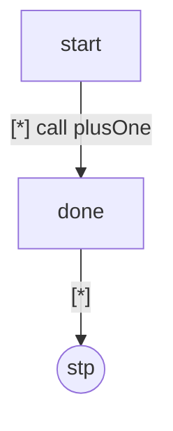

```
$ tmt compile -O1 --emit-ir=after:inline -o inlined.tmo inline.tmc
$ tmt ir graph inlined.ir.json --function main
```

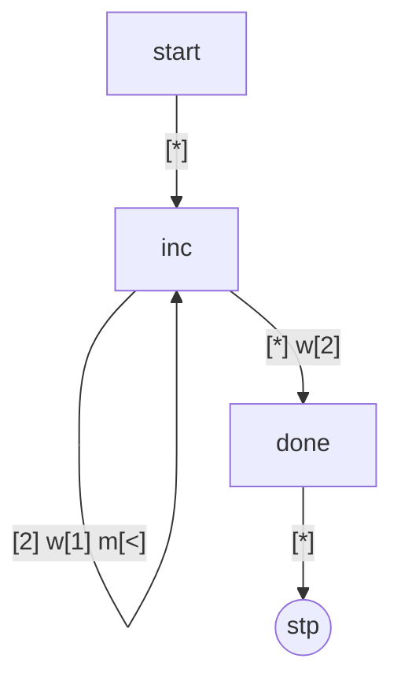

The callee's state is copied into the caller as `S2`, the call row that
reached it becomes a plain `goto`, and the callee's `return` row is
rewritten to the call's continuation — `done`, which is where the call
said to resume. Caller and callee have one tape each here; where the
callee is narrower, each copied row is widened to the caller's arity
with wildcard, keep and stay on every tape the callee did not take —
the identity on those tapes, so the splice neither reads nor writes
there.

`S0` is now an empty forwarder, which is `jump-threading`'s to retarget
and `dce`'s to delete, both later in the same round. The routine world
itself is never deleted by this pass — a fully-inlined routine lingers
inert until the linker, finding no call site left, drops it from the
image (`docs/core.md (linking)`):

```
$ tmt compile -O1 -o inline.tmo inline.tmc && tmt link inline.tmo -o inline.tmx
$ tmt dis inline.tmx
.routine main, tapes=1, alpha=(3)
.section tables
T0:     .row    [2]
.section code
.func main
L0001:  rd
        mtc     T0
        jm      L0014
        wrmv    [2], [.]
        jmp     L001C
L0014:  wrmv    [1], [<]
        jmp     L0001
L001C:  stp
```

A `brk` row inside a spliced callee is copied verbatim into every
splice, so each instance keeps its own pause address — the same
per-instance duplication a graft produces. Because inlining binds a call
at compile time, a library meant to stay interposable should be built
with `--fno-inline`.

### outline

The inverse of `inline`: where `inline` dissolves a call, `outline`
hoists a repeated subgraph into a shared routine and replaces each copy
with a call to it. It is program-level, runs immediately after `inline`,
and is the one pass that **defaults off** — `--foutline` turns it on.
The decision paragraph is below the example.

Within one world it looks for groups of two or more disjoint subgraphs
that are structurally identical modulo renumbering — the shape repeated
graft instances leave behind. A candidate subgraph must be *exit-free*
(every internal row is a plain `goto`; a `return`, `stop`, `halt`, trap
or call inside would change which frame ends), *single-junction* (one
root with inbound edges from outside, and exactly one external target
that every leaving edge converges on), *brk-free* (a `debugger` anywhere
in the subgraph refuses the fold, so no observable pause address is ever
moved into a routine), and at least seven states. The junction is part
of the fold key, so two subgraphs with identical bodies that resume in
different places never fold — they would return to the wrong place.

This program's two chains each contain a cycle, which matters:

```tmc
alphabet ab { '_', 'a', 'b' }
machine {
  tape t: ab;
  entry state start { ['a'] -> goto a0; ['b'] -> goto b0; [*] -> stop; }
  state a0 { ['a'] -> move [>] goto a1; [*] -> goto mid; }
  state a1 { [*] -> move [>] goto a2; }
  state a2 { [*] -> move [>] goto a3; }
  state a3 { [*] -> move [>] goto a4; }
  state a4 { [*] -> move [>] goto a5; }
  state a5 { [*] -> move [>] goto a6; }
  state a6 { [*] -> goto a0; }
  state b0 { ['a'] -> move [>] goto b1; [*] -> goto mid; }
  state b1 { [*] -> move [>] goto b2; }
  state b2 { [*] -> move [>] goto b3; }
  state b3 { [*] -> move [>] goto b4; }
  state b4 { [*] -> move [>] goto b5; }
  state b5 { [*] -> move [>] goto b6; }
  state b6 { [*] -> goto b0; }
  state mid { [*] -> stop; }
}
```

`tail-merge` cannot share these chains: two states merge only when their
transitions name the same target id, and each chain's back edge names
its own root, so no pair along the two cycles is ever equal. Left to the
default pipeline, both chains survive in full:

```
$ tmt compile -O1 -v -o off.tmo outline.tmc
opt: 2 round(s)
  jump-threading main: 2 change(s)
  dce main: 2 change(s)
  dispatch-select main: 2 change(s)
```

With `--foutline` the group folds:

```
$ tmt compile -O1 -v --foutline --emit-ir=after:outline -o on.tmo outline.tmc
opt: 2 round(s)
  outline (module): 1 change(s)
  jump-threading main: 2 change(s)
  jump-threading main.outline0: 1 change(s)
  tail-merge main: 7 change(s)
  dce main: 6 change(s)
  dce main.outline0: 1 change(s)
$ tmt ir graph on.ir.json --function main.outline0
```

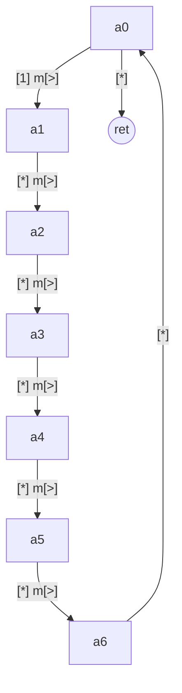

The region's back edge survives inside the routine as `S6 -> S0`, and
the row that used to escape to `mid` is now the routine's `return`.

One copy is hoisted into a synthesized routine named `<world>.outline<n>`
— a dotted name the `.tmc` grammar cannot mint, so it never collides
with a user routine, and one the `.tma` assembler accepts, since codegen
re-emits it. Each escape to the junction has become a `return`. Both
occurrences' roots are rewritten to a one-row trampoline: a **bindless**
call into the routine — a plain same-frame call, so the object stays
linkable under all three mechanisms — resuming at that occurrence's
junction. The now-orphaned copies are left behind, which is what the
`tail-merge` and `dce` counts in that report are clearing up.

In the final graph only one trampoline is left. The two are identical
rows resuming at the same junction, so `tail-merge` collapsed them, and
both of `start`'s arms now enter the same state:

```
$ tmt compile -O1 --foutline --emit-ir=final -o final.tmo outline.tmc
$ tmt ir graph final.ir.json --function main
```

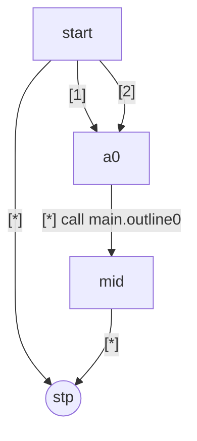

The trade, in the linked image, is a call and a return per occurrence
against one shared copy of the body:

```
$ tmt link off.tmo -o off.tmx && tmt link on.tmo -o on.tmx
$ wc -c off.tmx on.tmx
     163 off.tmx
     135 on.tmx
     298 total
```

Here that is a win, because the shared body is seven states long and
there are two occurrences of it. **Why it is off by default** is that
this is not the usual outcome. Most repeated shapes that survive to this
point are already shared for free by `tail-merge`, which costs nothing
at run time; where that has happened, outlining only adds indirection.
Take the back edges out of the program above — replace each `state a6 {
[*] -> goto a0; }` with `[*] -> goto mid;`, and likewise for `b6` — and
the two chains become acyclic, which is enough for `tail-merge` to
collapse them on its own. On that program `--foutline` makes the image
*larger*:

```
$ tmt compile -O1 -v -o nc-off.tmo nocycle.tmc
opt: 2 round(s)
  jump-threading main: 2 change(s)
  tail-merge main: 7 change(s)
  dce main: 1 change(s)
  dispatch-select main: 1 change(s)
$ tmt compile -O1 --foutline -o nc-on.tmo nocycle.tmc
$ tmt link nc-off.tmo -o nc-off.tmx && tmt link nc-on.tmo -o nc-on.tmx
$ wc -c nc-off.tmx nc-on.tmx
     115 nc-off.tmx
     131 nc-on.tmx
     246 total
```

The seven `tail-merge` changes in that first report are the sharing
happening without any help; paying for a call and a return on top of it
costs sixteen bytes.

The pass also converts straight-line control flow into calls, which
changes frame-stack depth and so moves a program's resource-limit
behaviour — permitted by the equivalence contract, but a real change in
what a stack-tight program does. It is opt-in because it is a judgement
about a particular program's shape, not a rule that holds generally.

The outlined routine in this example also shows
`dispatch-select`'s world restriction in the concrete. In the
`--foutline` build the two-row root state lives in a routine and keeps
its dispatch table (`djmp`); without outlining the same two-row shape
sits in the `machine` world and is flipped to the branch form (`jm`) —
the same rows, lowered two ways, for the linkability reason given in the
contracts above.

A multi-exit variant — one body shared across a group regardless of exit
count — would need frames-profile artifacts that a `mono` link refuses,
contradicting the mode-independence a compiled object otherwise keeps,
so it is deliberately not part of this pass.

### jump-threading

An inbound reference to an *empty forwarder* — a state whose single
all-wildcard row has no write, no move, no `debugger`, and whose only
act is a `goto` — is retargeted to the forwarder's own destination. A
chain of such forwarders collapses in one application of the pass, since
the resolver chases them transitively. The world entry counts as an
inbound reference too.

The pass moves edges only. The forwarders it orphans are `dce`'s to
delete, later in the same round.

```tmc
alphabet ab { '_', 'a', 'b' }
machine {
  tape t: ab;
  entry state start { ['a'] -> goto hop1; [*] -> goto hop2; }
  state hop1 { [*] -> goto hop2; }
  state hop2 { [*] -> goto work; }
  state work { [*] -> move [>] halt; }
}
```

```
$ tmt compile -O1 -v --emit-ir=lowered -o lowered.tmo jump-threading.tmc
opt: 2 round(s)
  jump-threading main: 3 change(s)
  tail-merge main: 1 change(s)
  dce main: 1 change(s)
  dispatch-select main: 1 change(s)
$ tmt ir graph lowered.ir.json --function main
```

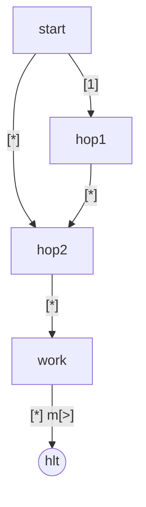

```
$ tmt compile -O1 --emit-ir=after:jump-threading -o threaded.tmo jump-threading.tmc
$ tmt ir graph threaded.ir.json --function main
```

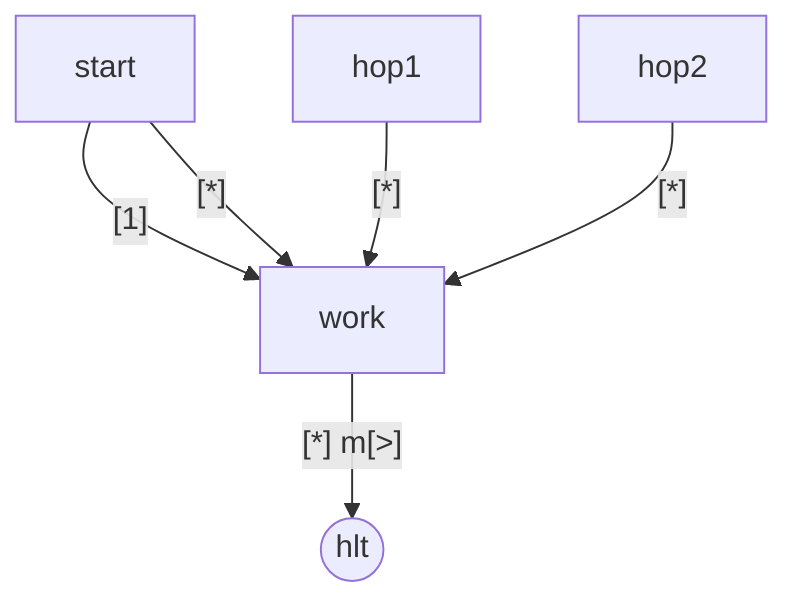

Both of `start`'s rows now reach `work` directly, and so does the edge
out of `hop1` — three retargets, the two forwarders left in place and
unreferenced because the snapshot is taken between the two passes. By
the end of the round `dce` has removed them:

```
$ tmt compile -O1 --emit-ir=final -o final.tmo jump-threading.tmc
$ tmt ir graph final.ir.json --function main
```

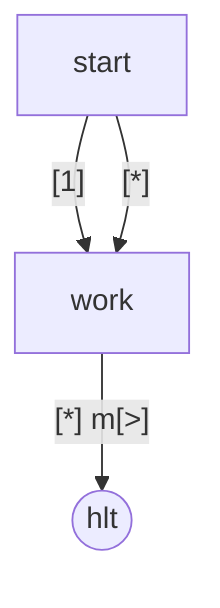

A *cycle* of empty forwarders is left exactly as written — it is a
deliberate infinite loop, and threading it would be a rewrite of intent:

```tmc
alphabet ab { '_', 'a' }
machine {
  tape t: ab;
  entry state spin { [*] -> goto spin; }
}
```

```
$ tmt compile -O1 -v -S -o spin.tma spin.tmc
opt: 1 round(s)
$ cat spin.tma
.routine main, tapes=1, alpha=(2)
.func main
spin:
        jmp     spin
```

Requiring the forwarder's row to be free of a `debugger` is this pass's
share of the brk barrier. A forwarder-shaped row carrying one is a pause
point, and threading through it would elide the pause — so as far as
this pass is concerned, such a state is simply not a forwarder.

### tail-call

A call in tail position — a row whose transition is `call target … then
return` — becomes a direct transfer to the callee instead of a call
followed by a resume that immediately returns. The callee's own `return`
then pops the frame the *original* caller pushed, so the intermediate
stack slot and the return trip are both saved. Codegen emits it as a
relocated external jump.

Two guards, both load-bearing. **Routine worlds only**: a `machine`
world's terminators are `stp` and `hlt`, and the language rejects
`return` outside a routine, so a `call … then return` cannot occur there
at all — the restriction is structural rather than a policy. **Bindless
calls only**: a bound call rides the frames stack discipline, where the
paired call and return push and restore the frame register
(`docs/tmt/isa.md (the frames execution profile)`). Transferring with a
bare jump would skip that push, and the callee's return would restore
the wrong frame and desync the stack. Only a bindless call — a plain
call the linker resolves — is safe to turn into a jump.

```tmc
alphabet ab { '_', 'a' }

use lib::ext;

export routine caller(tape t: ab) {
  entry state go { [*] -> call ext() then return; }
}

machine {
  tape t: ab;
  entry state m { [*] -> stop; }
}
```

```
$ tmt compile -O1 -v --emit-ir=lowered -o lowered.tmo tail-call.tmc
opt: 2 round(s)
  tail-call caller: 1 change(s)
$ tmt ir graph lowered.ir.json --function caller
```

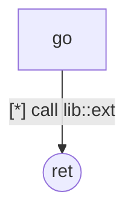

```
$ tmt compile -O1 --emit-ir=after:tail-call -o tailed.tmo tail-call.tmc
$ tmt ir graph tailed.ir.json --function caller
```

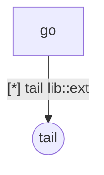

The call-and-return has become a single outbound transfer, which the
renderer routes to the shared `tail` terminal because control leaves
this world for good — there is no return trip to draw.

This rewrite is not motion: it changes the transition of the *same* row
and leaves any `brk` on it exactly where it was, so codegen still emits
the breakpoint immediately before the jump. A debugger-bearing tail call
therefore converts like any other, with no brk-barrier interaction.

### tail-merge

Whole-**state** dedup. Two states in one world whose row lists are
identical — same length, and for each row the same pattern, write,
moves, `debugger` flag, synthesized flag and transition, with source
line provenance ignored — and whose dispatch hint matches, collapse into
one. The lower-id state is kept, every reference to the other is
retargeted onto it, the duplicate is dropped, and the survivors are
densely renumbered.

Because two transitions are equal only when their target ids are equal,
states that differ only in where they `goto` never merge — including two
structurally identical self-loops, whose `goto` targets are their own
distinct ids. That is conservative but always sound: equal transitions,
numeric targets included, guarantee identical behaviour after the
retarget.

```tmc
alphabet ab { '_', 'a', 'b' }
machine {
  tape t: ab;
  entry state start { ['a'] -> goto markA; [*] -> goto markB; }
  state markA { [*] -> write ['b'] move [>] goto done; }
  state markB { [*] -> write ['b'] move [>] goto done; }
  state done  { [*] -> stop; }
}
```

```
$ tmt compile -O1 -v --emit-ir=lowered -o lowered.tmo tail-merge.tmc
opt: 2 round(s)
  tail-merge main: 1 change(s)
  dispatch-select main: 1 change(s)
$ tmt ir graph lowered.ir.json --function main
```

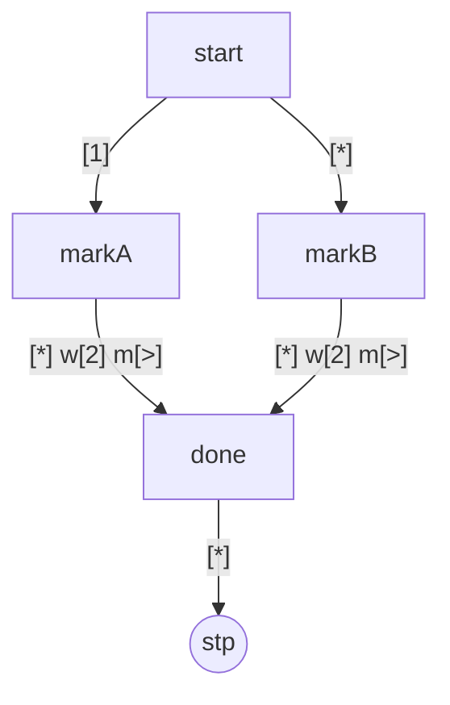

```
$ tmt compile -O1 --emit-ir=after:tail-merge -o merged.tmo tail-merge.tmc
$ tmt ir graph merged.ir.json --function main
```

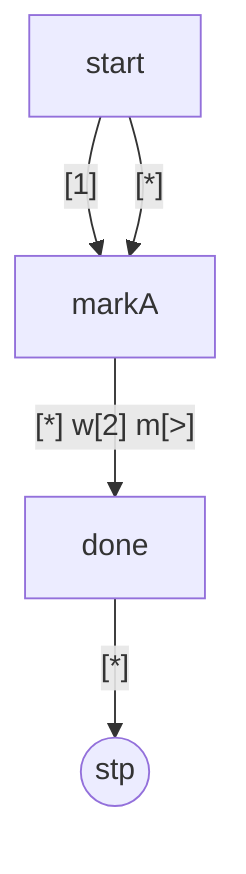

Both of `start`'s rows now reach the one surviving copy, and `done` has
been renumbered from `S3` to `S2` to keep ids dense.

A state containing a `debugger` row is **never** merged — not as keeper,
not as duplicate — because collapsing two identical pause-bearing states
would fuse two distinct observable addresses into one. This is stricter
than the `.pmc` block merge, which treats `brk` as an ordinary equal op;
the TM optimizer holds the barrier here instead. The contracts section
above shows the refusal and what it costs a stripped build.

The `.pmc` pass's second half, return-chaining, does not transpose to
this IR and is not ported. There a terminal is a separate block that an
adjacent pair can share by falling through; here a terminal is a
per-rule transition, codegen already elides fall-through for `goto`s,
and routing to a shared terminal through a multi-byte jump would be
strictly larger than the one-byte `ret` / `stp` / `hlt` emitted inline.
The one shape it could have targeted — two states each a single
all-wildcard `return` — is already caught by the whole-state dedup
above.

### dce

Deletes the states of a world that are not reachable from its entry,
walking intra-world edges only — a `goto` and a `call … then goto`
resume target. A `call`'s own target names another world, so it is not
an intra-world edge; whole uncalled worlds are the linker's business,
not this pass's (`docs/core.md (linking)`). It is reachability only — no
liveness, no value reasoning — which is why it can never leave a
reachable transition pointing at a state that no longer exists. Because
the IR requires dense ids, a deletion renumbers the survivors and
retargets the entry and every surviving edge.

Most of its work is cleaning up after other passes: the forwarders
`jump-threading` orphaned, the copies `outline` trampolined past. Code
written unreachable is caught earlier and separately, as a compile
warning, and then removed here:

```tmc
alphabet ab { '_', 'a' }
machine {
  tape t: ab;
  entry state start { [*] -> move [>] goto done; }
  state orphan { [*] -> move [<] halt; }
  state done   { [*] -> stop; }
}
```

```
$ tmt compile -O1 -v --emit-ir=lowered -o lowered.tmo dce.tmc
dce.tmc:5:9: warning: state `orphan` is unreachable in `main`
opt: 2 round(s)
  dce main: 1 change(s)
$ tmt ir graph lowered.ir.json --function main
```

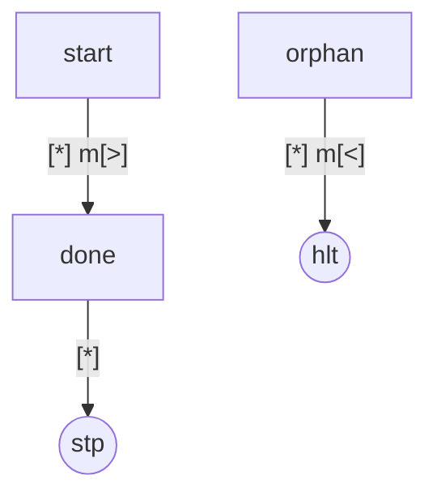

```
$ tmt compile -O1 --emit-ir=after:dce -o alive.tmo dce.tmc
dce.tmc:5:9: warning: state `orphan` is unreachable in `main`
$ tmt ir graph alive.ir.json --function main
```

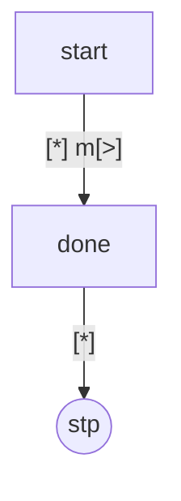

`done` renumbers from `S2` to `S1`, `start`'s edge follows the remap,
and the `hlt` terminal disappears with the only state that reached it.

An unreachable state carrying a `debugger` is deleted like any other.
The barrier forbids motion across a *reachable* pause; an unreachable
one can never fire, so removing the dead state that holds it changes
nothing observable.

### dead-rows

Within one state, deletes a match row that can never fire because an
earlier, higher-priority row in the same dispatch band already covers
every input it would match. This is the first of the two passes with no
`.pmc` counterpart — it exists because a TM-1 state dispatches on a list
of rows rather than on one bit.

Row `W` covers row `R` when, at every tape position, `W`'s cell is a
wildcard or both cells are the same concrete index; then everything `R`
matches, `W` matches too. Only *single*-row cover is computed: a row
jointly covered by two or more earlier rows is not deleted.

"Same band" is the load-bearing qualifier, and it is a consequence of
how rows are lowered. Codegen does not emit rows in source order — it
re-bands a conditional state into all-concrete rows first, then mixed
rows, then all-wildcard catch-alls, and the match engine takes the first
row that matches in *that* order
(`docs/tmt/language.md (which rule fires)`).
So an earlier source row shadows a later one it covers only
when both land in the same band, where source order and runtime order
agree. Across bands the shadow is false: a source-earlier catch-all does
not shadow a later exact row, because codegen emits the exact row first
and the exact row wins. A covering row always has at least as many
wildcards as the row it covers, so its band is never earlier —
which makes "same band" exactly the sound subset.

```tmc
alphabet abc { '_', 'a', 'b' }
machine {
  tape x: abc;
  tape y: abc;
  tape z: abc;
  entry state s {
    ['a', *,   *] -> move [>, ., .] goto s;
    ['a', 'b', *] -> move [>, ., .] goto s;
    [*,   *,   *] -> stop;
  }
}
```

```
$ tmt compile -O1 -v --emit-ir=lowered -o lowered.tmo dead-rows.tmc
opt: 2 round(s)
  dead-rows main: 1 change(s)
  dispatch-select main: 1 change(s)
$ tmt ir graph lowered.ir.json --function main
```

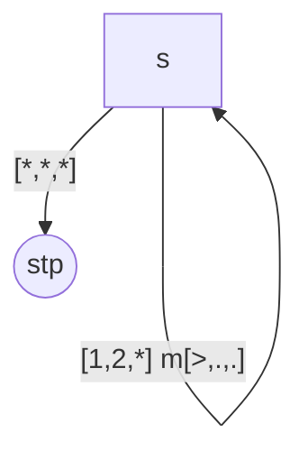

```
$ tmt compile -O1 --emit-ir=after:dead-rows -o trimmed.tmo dead-rows.tmc
$ tmt ir graph trimmed.ir.json --function main
```

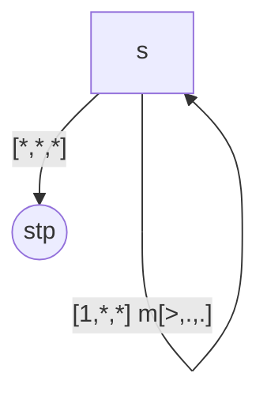

`[1,*,*]` and `[1,2,*]` are both mixed rows, so they share the partial
band and source order is runtime order; the first covers the second,
which therefore can never fire and is deleted. The catch-all survives —
it is in a different band, and no single row covers it.

That report is also the `dead-rows`-before-`dispatch-select` ordering
contract happening in front of the reader. Deleting the shadowed row
left the state with exactly two rows, a selective one followed by a
catch-all, which is precisely the shape the next pass in the pipeline
flips — and it flips it in the same round. Run the other order and the
opportunity would not exist yet.

Deleting rows changes no state ids and no transition targets, so nothing
needs renumbering. The first row is never covered by an earlier one, so
at least one row always survives.

A dead row carrying a `debugger` is deleted like any other, on the same
logic `dce` uses: a row an earlier same-band row always shadows can
never match, so its pause could never have fired.

### dispatch-select

Picks the compact branch lowering for a state whose match is exactly
"one selective row, then an all-wildcard catch-all". This is the second
TM-only pass, and the only pass on this page that changes no graph shape
at all: the two rows stay exactly as they are, and only the state's
lowering hint moves. Because `tmt ir graph` does not draw that hint, the
example reads from `-S` assembly.

A state qualifies only if it lives in the `machine` world, has exactly
two rows, the second is an all-wildcard catch-all, the first is not, and
its dispatch is still the canonical table form — that last condition
making the pass idempotent, so the fixpoint converges. Each guard is
forced. `jm` tests the match register alone, so a branch can express
exactly "the selective row matched, else the catch-all"; a state whose
second row is *not* a catch-all needs the trap-on-no-match behaviour a
dispatch jump gives, which a fall-through cannot express. A state whose
*first* row is already all-wildcard has a shadowed second row that
`dead-rows` will drop, leaving a single row that codegen lowers
straight-line — not a branch either. And the `machine`-world restriction
is the mono-linkability contract stated above.

The pass does not special-case a `debugger` row: since neither row is
ever deleted or merged, a row carrying one keeps it in both lowerings,
and only its code offset moves between the dispatch-table and branch
forms — the same layout-not-meaning distinction the equivalence contract
draws for trap offsets above.

The same `dead-rows` program is the input; `--fno-dispatch-select`
isolates the difference.

```
$ tmt compile -O1 --fno-dispatch-select -S -o table.tma dead-rows.tmc
$ cat table.tma
.section tables
T0:     .row    [1, *, *]
        .row    [*, *, *]
D0:     .targets s__0, s__1
.section code
.routine main, tapes=3, alpha=(3, 3, 3)
.func main
s:
        rd
        mtc     T0
        djmp    D0
s__0:
        wrmv    [-, -, -], [>, ., .]
        jmp     s
s__1:
        stp
$ tmt compile -O1 -S -o branch.tma dead-rows.tmc
$ cat branch.tma
.section tables
T0:     .row    [1, *, *]
.section code
.routine main, tapes=3, alpha=(3, 3, 3)
.func main
s:
        rd
        mtc     T0
        jm      s__m
        stp
s__m:
        wrmv    [-, -, -], [>, ., .]
        jmp     s
```

The two-row match table becomes a one-row table, the dispatch table
disappears entirely, and the `djmp` through it becomes a single `jm`
with the catch-all inline as the fall-through
(`docs/tmt/isa.md (match and dispatch)`). The instruction count is
unchanged — six either way; what the pass removes is table data, one
match row and a whole dispatch entry, which on this program is thirteen
bytes off the linked image:

```
$ tmt compile -O1 --fno-dispatch-select -o t.tmo dead-rows.tmc
$ tmt compile -O1 -o b.tmo dead-rows.tmc
$ tmt link t.tmo -o t.tmx && tmt link b.tmo -o b.tmx
$ wc -c t.tmx b.tmx
      85 t.tmx
      72 b.tmx
     157 total
```

## Flags

All three flags below belong to `tmt compile`. `tmt build` takes
`-O0`/`-O1`, `--fno-<pass>` and `--foutline` as well, but not
`--emit-ir`: per-file graph inspection stays the single-file command's
job (`docs/tmt/cli.md (build)`).

### `--fno-<pass>`

Disables one pass for the whole compile, and is repeatable — the names
are the eight in the roster above. Two things it is good for: isolating
a pass while reading IR or assembly, as several examples on this page
do, and turning off `inline` for a library that must stay interposable.

```
$ tmt compile -O1 -v --fno-dispatch-select -o dr.tmo dead-rows.tmc
opt: 2 round(s)
  dead-rows main: 1 change(s)
```

The suffix is not validated against the roster: `--fno-` followed by
something that is not a pass name is accepted and disables nothing, so a
typo shows up as an unchanged `-v` report rather than as an error. Only
the generated completion script renders the family from the real pass
list.

```
$ tmt compile -O1 -v --fno-deadrows -o dr.tmo dead-rows.tmc
opt: 2 round(s)
  dead-rows main: 1 change(s)
  dispatch-select main: 1 change(s)
```

At `-O0` the flag is accepted and has nothing to disable.

### `--foutline`

Enables `outline`, the one default-off pass. It has flags in both senses
and both are real: `--foutline` turns it on, and `--fno-outline` — which
the `--fno-` family renders because `outline` is a registered pass like
any other — keeps it off. `--fno-outline` wins over `--foutline` if both
are given. The flag takes effect only at `-O1`, because that is the only
level at which the optimizer runs at all. The paragraph under the
`outline` example above is the case for and against turning it on.

### `--emit-ir[=STAGE]`

Writes the world-graph IR as JSON to `<output base>.ir.json`
(`docs/formats.md (IR JSON)`). `STAGE` selects which graph: `lowered` is
the IR before any pass ran, `final` (the default) is what codegen
consumed, and `after:<pass>` is the IR right after that pass last
changed something. A pass that fires in several rounds captures a
snapshot per round and `after:<pass>` resolves to the last of them. The
stage argument is equals-only — `--emit-ir=lowered` is accepted,
`--emit-ir lowered` as two tokens is not — and the flag itself may
appear only once per command line (`docs/tmt/cli.md (--emit-ir)`).

Two different failures are worth telling apart. An unrecognized stage
name is rejected up front, checked against the optimizer's own pass
list, with an error naming every stage that resolves. A *recognized*
stage whose pass simply did not fire on this input fails later, when the
snapshot is looked up and found missing; the object output is still
written, but no `.ir.json` sidecar is. Both are errors rather than a
silent fall-back, which is what lets an `after:<pass>` example on this
page prove that its pass really ran.

`tmt ir graph FILE.ir.json [--function NAME]` renders such a document as
a Mermaid flowchart — one per world, or one named world — which is how
every diagram on this page was produced (`docs/tmt/cli.md (ir)`).
